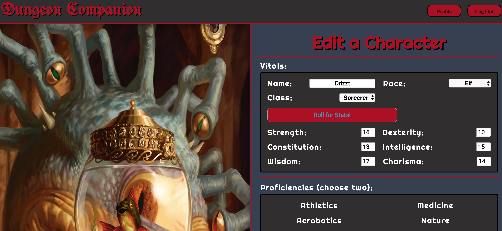
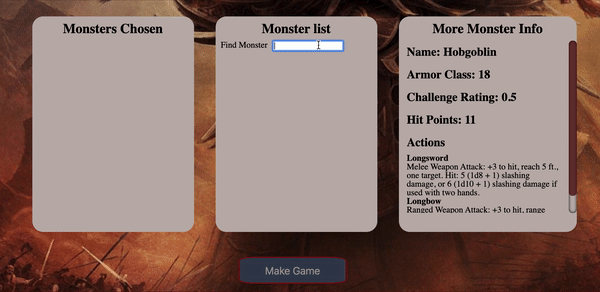

# Dungeon Companion
## [Link to the live site](https://dungeon-companion-app.herokuapp.com/)
## By Ezra Schrage, [Michael Norton](https://github.com/Norton-Design), [Rory Evenson-Phair](https://github.com/roryphair), [Tika Tsiklauri](https://github.com/Tikatsiklauri)

Welcome to Dungeon Companion! A website dedicated to helping people run Dungeons & Dragons 5th Edition campaigns. Using the Open Game License, this website
aims to be a tool for players and dungeon masters alike. Players can create and save their own characters to keep track of their progress through the adventure.
Dungeon masters can craft battles to help them keep track of combat by monitoring initiative, turn order, and health points. So prepare your
spell sheets and ready your weapons, because it is time for Dungeon Companion!

### Technologies
- MongoDB for database
- Express for server framework
- React for frontend framework
- NodeJS for package management
- SASS
- HTML

In readme, instead of having features and highlights, you should have a header 
for each feature you're calling out and they should each have a code snippet and/or image or gif accompanying them

### Character Creator




### Battle Creator


### Battle Manager


### CRUD functionality


```Javascript
          bcrypt.genSalt(10, (err, salt) => {
            bcrypt.hash(newUser.password, salt, (err, hash) => {
              if (err) throw err;
              newUser.password = hash;
              newUser.save()
                .then(user => {
                    const payload = { id: user.id, username: user.username, email: user.email};

                    jwt.sign(payload, keys.secretOrKey, { expiresIn: 3600 }, (err, token) => {
                        res.json({
                        success: true,
                        token: "Bearer " + token
                        });
                    });
                })
                .catch(err => (err));
            })
          })
```


- Character creator using Dungeons & Dragons 5th edition rules, with customization of statistics, class, proficiencies, and fantasy race
- Battle creator that allows user to create a list of particpants from a list of saved characters as well as monsters
- Battle manager that tracks the initiative, health points, and current turn of all participants in a battle
- Battle manager and creator use an API for the monsters to retrieve all of their statistics from the monster manual
- CRUD functionality for users, characters, and battles


### Highlights

The battle creator would be functional but not as helpful without the ability to put in monsters with pre-built statistics. To make this feature more convenient,
a D&D rules API allows the user to look up in real time any monster. This will also call the monster's attacks, special abilities, challenge rating, and 
statistics. No more will a user need to comb through the manual to look up every monster entry.



The battle manager was created with the goal of taking as much busy work out of the hands of the dungeon master as possible. To that end, battle manager
will roll the dice for each character and monster to determine who goes first based on their dice roll and inherent bonuses. Once this initiative is determined,
they are ordered properly. The dungeon master then may click forward to advance the turn and change any particpants health points. As characters and monsters die,
they are removed from the battlefield and skipped over in the next round of combat. Below is a snippet of the code that displays some of this logic, as well as
the character and monster display functions. These functions allow for the display of just the names or the full statistics.

```Javascript
    setOrder(game){
        const order = game.monsters.concat(game.players);
        return order.sort((a,b) => Math.sign(b.initiative - a.initiative));
    }

    showMonster(monster){
        return (e) => {
            if(!this.props.monsters[monster.name]){
                this.props.fetchMonster(monster.index)
                .then((newMonst) => this.setState({monsterInfo: newMonst.monster }))
            }else{
                this.setState({monsterInfo: this.props.monsters[monster.name]})
            }
        }
    }

    showCharacter(character){
        return (e) => {
            if(!this.props.characters[character.id]){
                this.props.getCharacter(character.id)
                .then(({character}) => this.setState({characterInfo: character }))
                .catch(() => this.setState({characterInfo: 'Error'}));
            }
            else{
                this.setState({characterInfo: this.props.characters[character.id]})
            }
        }
    }

    adjustHpCreature(idx){
        return (e) => {
            let oldState = {...this.state}
            let newHp = this.state.order[idx].hp + parseInt(e.currentTarget.value);
            oldState.order[idx].hp = newHp
            this.setState(oldState);
            e.currentTarget.value = 0;
        }
    }
```


Attributions

- [D&D 5th Edition API Documentation](http://www.dnd5eapi.co/)
- [Images from Wizards of the Coast D&D wallpaper gallery](https://dnd.wizards.com/articles/media-resources/wallpapers)
- Dungeon Companion is unofficial Fan Content permitted under the Fan Content Policy. Not approved/endorsed by Wizards. Portions of the materials used are property of Wizards of the Coast. ©Wizards of the Coast LLC.